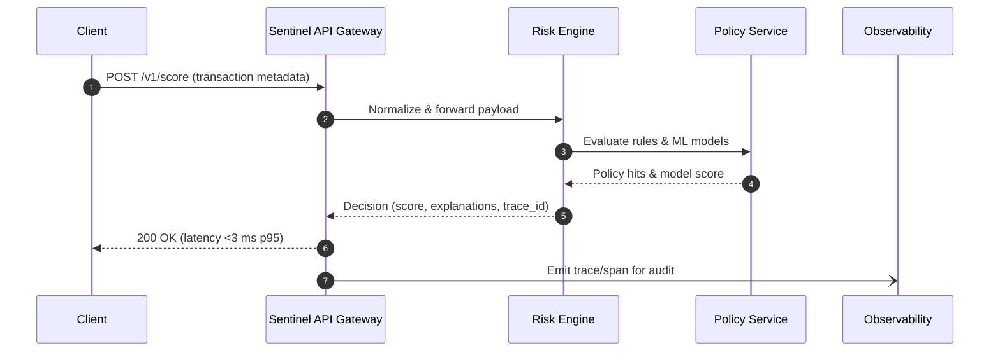
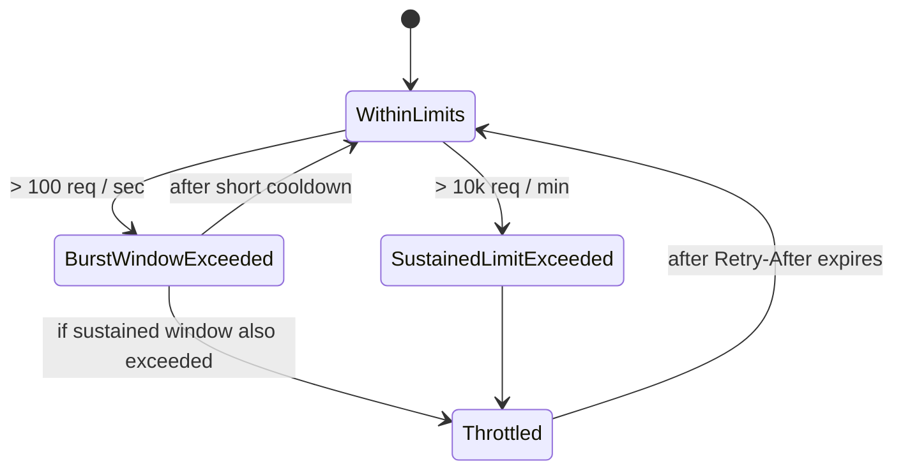

# Visual Diagrams

Use these Mermaid diagrams in the documentation platform to visualize critical flows.

## Real-Time Scoring Sequence



## Authentication Flow

```mermaid
flowchart LR
  A[Client App] -->|Client credentials| B(IdP / OAuth Server)
  B -->|Access token| A
  A -->|mTLS handshake (optional)| C[Sentinel API]
  A -->|Bearer token or X-Api-Key| C
  C --> D[Scope & rate limit check]
  D --> E[Request routed to service]
  D --> F[429 if burst exceeded]
```

## Rate Limit Explainer


